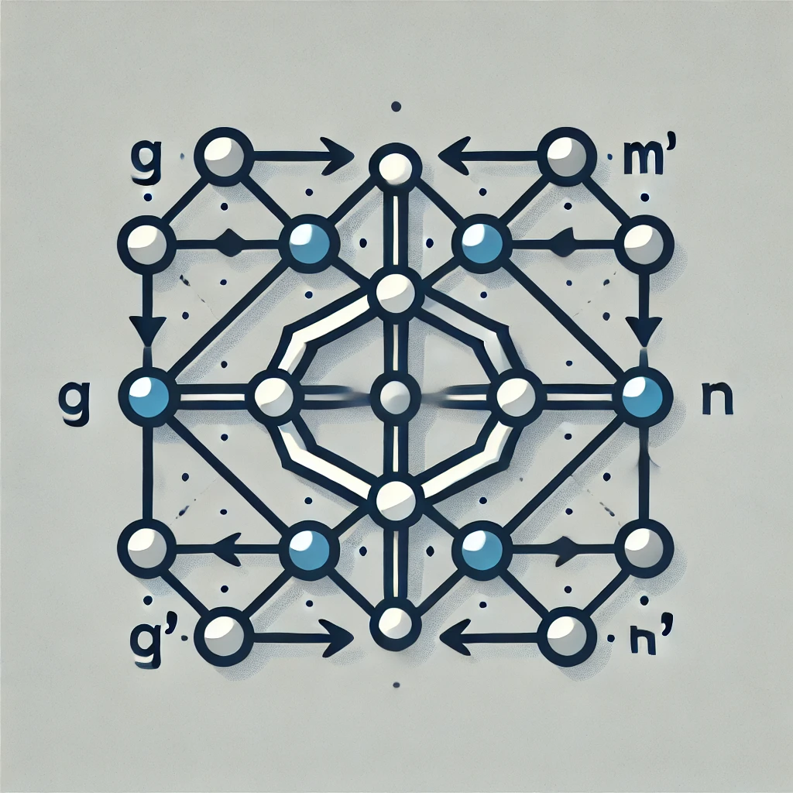

- Monoidal E-Graphs paper can be accessed [here](https://github.com/Tiltedprogrammer/e_hypergraphs_paper/releases/latest/download/arxiv.pdf)
- Closed Monoidal E-Graphs can be accessed [here](https://github.com/Tiltedprogrammer/e_hypergraphs_paper/releases/latest/download/LICS25Closed.pdf)
- EGraphs2024 Extended Abstract can be accessed [here](https://github.com/Tiltedprogrammer/e_hypergraphs_paper/releases/latest/download/EGraphs2024ExtendedAbstract.pdf)
- Slides can be found [here](https://github.com/Tiltedprogrammer/e_hypergraphs_paper/releases/latest/download/slides.pdf)
- Notes on enrichment and closed monoidal e-hypergraphs are [here](https://github.com/Tiltedprogrammer/e_hypergraphs_paper/releases/latest/download/closed_monoidal.pdf)

